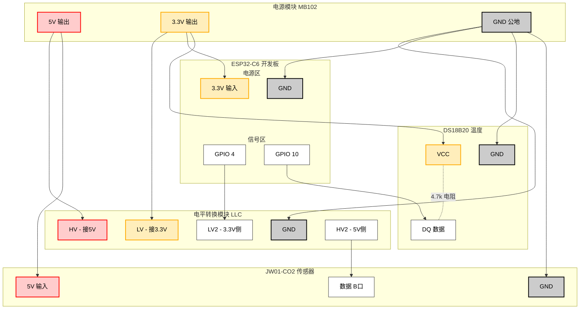

# 小鼠饲养环境监测传感器

## 功能概述

收集 $$CO_2$$ 浓度和温度数据，通过Wi-Fi上传至服务器

## 硬件

1. ESP32-C6-DevKitC-1开发板

   【淘宝】7天无理由退货 https://e.tb.cn/h.71ENK0ASa7KFQQ2?tk=GeUTfHxQGTk CZ321 「ESP32-C6-N16 核心板ESP32-C6-DevKitC-1乐鑫WIFI6 BLE Zigbee」
   点击链接直接打开 或者 淘宝搜索直接打开

2. 电源模块（购买链接如下）

   【淘宝】7天无理由退货 https://e.tb.cn/h.71ng91iKZEwUy78?tk=7PinfHxSM4K CZ007 「Type-C单片机UPS电源模块 锂电池充放电 UPS不间断电源5V、3.3V」
   点击链接直接打开 或者 淘宝搜索直接打开

3. 18650电池4节

   【淘宝】7天无理由退货 https://e.tb.cn/h.71nL5ByFp5F8ES2?tk=Yk2RfHxpDiM MF168 「全新原装【亿纬18650】锂电池大容量强光手电电池7000mAh高效循环」
   点击链接直接打开 或者 淘宝搜索直接打开

4. $ CO_2$浓度传感器`JW01-CO2-V2.2`

   【淘宝】7天无理由退货 https://e.tb.cn/h.7cI75qJ64zB1bhQ?tk=EatDfHxO8ux MF278 「CO2 二氧化碳传感器模组 串口输出 51单片机程序例程读取浓度显示」
   点击链接直接打开 或者 淘宝搜索直接打开

5. 温度传感器`DS18B20`

   【淘宝】假一赔四 https://e.tb.cn/h.71nlICQTfHFYCEv?tk=xsjTfHxmWc4 CZ001 「Risym DS18B20测温模块stm32温度传感器模块18B20开发板应用板」
   点击链接直接打开 或者 淘宝搜索直接打开

6. 电平转换模块

   【淘宝】7天无理由退货 https://e.tb.cn/h.71nNH9c1JAyqec8?tk=DVYHfHxMhT0 CZ028 「【YwRobot】适用于Arduino 电平转换模块 TTL 3.3V 5V转换」
   点击链接直接打开 或者 淘宝搜索直接打开

7. 杜邦线数根

## 接线

### 1. 电源模块 (Power Module)

- **3.3V 输出端：**
  - **3.3V** -> ESP32-C6 (3.3V pin)
  - **3.3V** -> DS18B20 (VCC)
  - **3.3V** -> **电平转换模块 (LV引脚)** *[必须连接]*
  - **GND** -> ESP32-C6 (GND)
  - **GND** -> DS18B20 (GND)
  - **GND** -> **电平转换模块 (GND)** *[必须连接]*
- **5V 输出端：**
  - **5V** -> JW01-CO2 (VCC/5V)
  - **5V** -> **电平转换模块 (HV引脚)** *[必须连接]*
  - **GND** -> JW01-CO2 (GND)

### 2. ESP32-C6 开发板

- **3.3V**：接电源模块 3.3V
- **GND**：接电源模块 GND
- **GPIO 10**：接 DS18B20 的 DQ 脚
- **GPIO 4**：接 电平转换模块的 **LV2**

### 3. 电平转换模块 (Level Converter)

为了让 ESP32 (3.3V) 能安全地和 CO2传感器 (5V) 通信：

- **参考电压（供电, 我最开始的时候不知道接这里的线，但是单片机可以正常读取数据）：**
  - **HV**：接 电源模块 5V
  - **LV**：接 电源模块 3.3V
  - **GND**：接 电源模块 GND (两边的GND通常是通的，接一边即可，建议接电源模块公地)
- **信号通道 2：**
  - **LV2**：接 ESP32-C6 **GPIO 4**
  - **HV2**：接 JW01-CO2 **数据B口**

### 4. 传感器

- **DS18B20**：
  - VCC -> 3.3V
  - GND -> GND
  - DQ -> ESP32 **GPIO 10**
  - *(提醒：如果读取不到数据，请检查DQ和VCC之间是否有4.7k电阻)*
- **JW01-CO2**：
  - 5V -> 5V
  - GND -> GND
  - 数据B口 -> 电平转换模块 **HV2**




## 功能介绍

该项目是基于`esp-hal`开发的

```shell
src
├── bin
│   ├── co2_sensor.rs 
│   ├── final_app.rs
│   ├── temp_sensor.rs
│   └── wifi_app.rs
└── lib.rs
```

- `co2_sensor`: 测试二氧化碳传感器工作情况
- `temp_sensor`: 测试温度传感器工作情况
- `wifi_app`: 测试ESP32C6连接Wi-Fi情况
- `final_app`: 读取数据并上传的生产代码
